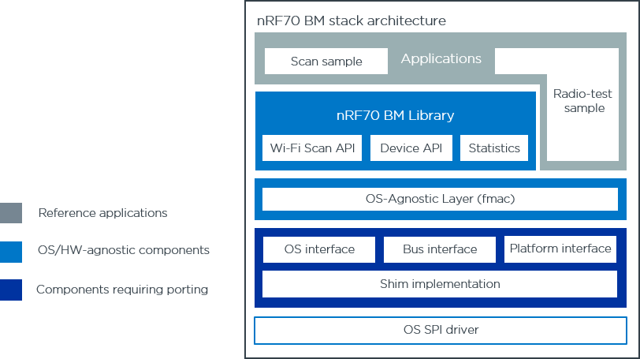

.. _nrf70_bm_lib:

Introduction
============

nRF70 Bare Metal (BM) library is a library that provides a set of APIs to interact with the nRF70 Series of ICs.
The library is not dependent on any RTOS. As such it may be used in a bare metal environment, as well as a
third-party RTOS environment (not nRF Connect SDK). This allows developers to easily port the library to any
platform of their choice.

Architecture
============

The software architecture of the nRF70 BM library is presented in the following figure.

   nRF70 Bare Metal stack architecture overview

OS-agnostic library
*******************

The library exposes the following functionality to the application

* nRF70 Series device initialization and de-initialization
* Wi-Fi scan, through a single-function API supporting a wide list of scan configuration parameters
* Obtaining statistics from the nRF70 Series device

Being fully RTOS-agnostic, the BM library is portable to any bare-metal or OS environment.

The user API of the library is fully described in :ref:`nrf70_bm_api`.

OS-agnostic driver layer
************************

The BM library uses the OS-agnostic nRF70 Wi-Fi driver layer to interact with the nRF70 Series device.
Only a subset of the OS-agnostic (FMAC) layer is required to support the scan and radio-test functionality
of the nRF70 BM library.

nRF70 Shim layer
****************

The nRF70 shim layer contains a reference implementation for the Zephyr RTOS. 

